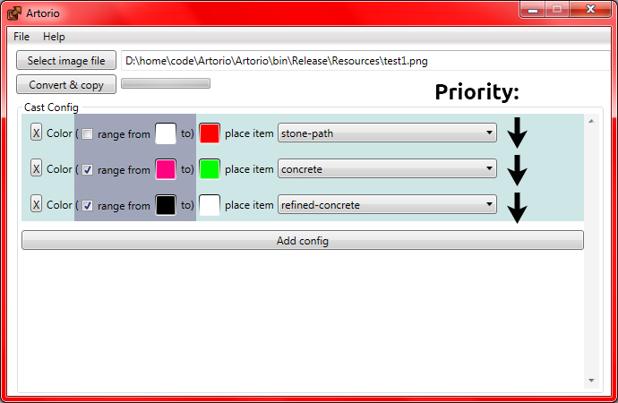

Artorio - convert image to factorio blueprint format.

[Video](https://youtu.be/e7S25XknIVE)

## RU :: Описание

Программа конвертирует изображение в блюпринтовский формат игры factorio, основываясь на заданных правилах.

Заданый в правилах цвет (или диапазон двух) пикселя превращает в заданный предмет. Тем самым можно быстро и легко перевести изображение в игру. Приоритет правил идёт сверху вниз.

## TODO

- [ ] User friendly interface
- [ ] Move config rule block up/down
- [ ] Localization support
- [ ] More colors/items
- [ ] Support image format: jpg, bmp
